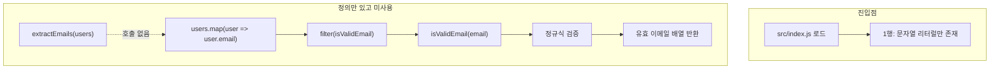

# cursor-demo 프로젝트 분석 보고서

**작성일:** 2026년 6월 9일  
**대상:** `cursor-demo` 프로젝트 (`src` 폴더 기준)  
**버전:** 1.0.0

---

## 1. 개요

본 보고서는 `cursor-demo` 프로젝트의 진입점, 모듈 구조, `extractEmails` 함수의 사용 현황, 그리고 `src` 폴더 기준 데이터 흐름을 분석한 결과를 정리합니다.

현재 프로젝트는 초기 스캐폴딩 단계로, 이메일 추출 유틸리티 함수가 작성되었으나 진입점 연결, export, 실제 호출 코드는 아직 구현되지 않은 상태입니다.

---

## 2. 프로젝트 구조

| 경로 | 설명 |
|------|------|
| `package.json` | 프로젝트 메타데이터 및 진입점 선언 |
| `src/index.js` | 유일한 소스 파일 |

`src` 폴더에는 **`index.js` 파일 1개**만 존재합니다.

---

## 3. 진입점 (Entry Point) 분석

### 3.1 선언된 진입점

`package.json`에 다음과 같이 설정되어 있습니다.

```json
"main": "index.js"
```

### 3.2 실제 소스 위치

실제 코드는 `src/index.js`에 위치하며, 루트 디렉터리에는 `index.js`가 **존재하지 않습니다**.

| 설정/위치 | 값 | 상태 |
|-----------|-----|------|
| `package.json` → `"main"` | `index.js` | 루트에 파일 없음 |
| 실제 소스 | `src/index.js` | 존재함 |

**결론:** 공식 진입점 선언과 실제 코드 위치가 **불일치**합니다.

### 3.3 직접 실행 시 동작

`node src/index.js`로 직접 실행할 경우, 파일 최상단 1행만 평가됩니다.

```javascript
"console.log('hello cursor');"
```

이 줄은 **문자열 리터럴**로만 존재하며, `console.log`가 실제로 호출되지 않습니다. 따옴표를 제거해야 콘솔 출력이 발생합니다.

---

## 4. `extractEmails` 함수 분석

### 4.1 정의 위치

- 파일: `src/index.js`
- 행: 10~17

### 4.2 호출 현황

**`extractEmails`는 프로젝트 전체에서 호출되지 않습니다.**

- 같은 파일 내 호출: 없음
- `module.exports` / `require` / `import`: 없음
- 다른 파일에서의 참조: 없음

함수는 **선언만 되어 있고**, 외부 모듈로보내지도 않으며, 실행 흐름에도 연결되어 있지 않습니다.

---

## 5. 함수별 상세 분석

### 5.1 `isValidEmail(email)` (5~8행)

| 항목 | 내용 |
|------|------|
| 입력 | `email` (문자열 기대) |
| 처리 | `typeof email === 'string'` 확인 후 정규식 `/^[^\s@]+@[^\s@]+\.[^\s@]+$/` 매칭 |
| 출력 | `boolean` |
| 비고 | RFC 완전 준수는 아닌 간단한 형식 검증 |

### 5.2 `extractEmails(users)` (10~17행)

| 항목 | 내용 |
|------|------|
| 입력 | `users` (배열 기대, 각 요소에 `email` 속성 가정) |
| 처리 | ① 배열이 아니면 `[]` 반환 → ② `users.map(user => user.email)` → ③ `.filter(isValidEmail)` |
| 출력 | 유효 이메일 문자열 배열 |

#### 예상 입·출력 예시

```javascript
const users = [
  { name: "Alice", email: "alice@example.com" },
  { name: "Bob",   email: "invalid-email" },
  { name: "Carol", email: "carol@test.org" }
];

// extractEmails(users) → ["alice@example.com", "carol@test.org"]
```

---

## 6. 데이터 흐름

현재 `src`에는 **입력 → 처리 → 출력**으로 이어지는 실행 가능한 파이프라인이 없습니다. 아래는 정의된 함수들의 **잠재적** 데이터 흐름입니다.



---

## 7. 발견 사항 요약

| 항목 | 내용 |
|------|------|
| 진입점 (선언) | `package.json` → `index.js` (파일 없음) |
| 진입점 (실제) | `src/index.js` (직접 실행 시) |
| `extractEmails` 호출 | **없음** — 정의만 존재 |
| 데이터 흐름 | 실행 가능한 파이프라인 없음 |
| 모듈 연결 | `module.exports` / `require` / `import` 없음 |
| 1행 코드 | 문자열 리터럴로만 존재, 실제 출력 없음 |

---

## 8. 권장 후속 작업

1. **진입점 정리** — `package.json`의 `"main"`을 `"src/index.js"`로 수정하거나, 루트에 `index.js`를 추가해 `src/index.js`를 re-export
2. **1행 수정** — `"console.log('hello cursor');"`에서 따옴표 제거하여 실제 실행되도록 변경
3. **모듈 export** — `extractEmails`, `isValidEmail`을 `module.exports`로보내 재사용 가능하게 구성
4. **호출 코드 추가** — 샘플 `users` 데이터를 넣고 `extractEmails` 호출·결과 출력 로직 연결
5. **테스트 추가** — `package.json`의 `test` 스크립트에 단위 테스트 구성

---

## 9. 결론

`cursor-demo` 프로젝트는 이메일 유효성 검증(`isValidEmail`)과 사용자 목록에서 이메일 추출(`extractEmails`)이라는 핵심 로직의 **골격**은 갖추었으나, 진입점·모듈화·실행 흐름이 아직 연결되지 않은 상태입니다. 위 권장 사항을 적용하면 독립 실행 가능한 유틸리티 모듈로 완성할 수 있습니다.

---

*본 보고서는 `src` 폴더 전체 분석 결과를 기반으로 작성되었습니다.*
